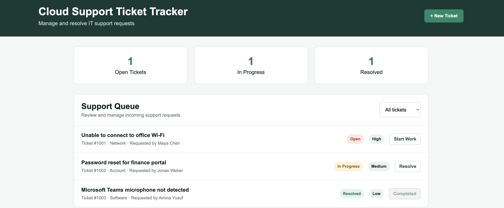

# Cloud Support Ticket Tracker

A small IT support queue built with Express and plain HTML, CSS, and JavaScript. Create tickets, filter by status, and move them from Open to In Progress to Resolved. Ticket data is saved on the server, so browser refreshes and container restarts keep changes.



## Run with Docker

```bash
docker compose up --build -d
```

Open <http://localhost:3000>. Compose stores tickets in the `tickets_data` named volume. `docker compose down` keeps that volume; `docker compose down -v` deletes it and all tickets. To use another host port, set `PORT`, for example `PORT=8080 docker compose up --build -d`.

Check the service with `docker compose ps` or `curl http://localhost:3000/health`. Stop it with `docker compose down`.

## Run without Docker

Requires Node.js 22 or newer.

```bash
npm ci
npm start
```

Open <http://localhost:3000>. Tickets are stored in `data/tickets.json`; this directory is ignored by Git. Set `DATA_FILE` to use a different JSON file, or `PORT` to change the listening port. Run `npm test` for the API tests.

## API

| Method | Path | Purpose |
| --- | --- | --- |
| GET | `/health` | Health check |
| GET | `/api/tickets` | List tickets |
| POST | `/api/tickets` | Create a ticket |
| PATCH | `/api/tickets/:id/status` | Move a ticket to the next status |

Create requests need a JSON body with `title`, `requester`, `category` (`Network`, `Account`, `Software`, or `Hardware`), and `priority` (`Low`, `Medium`, or `High`). The app starts with three example tickets when the data file is first created.

The JSON file is intended for a single app instance. If you need multiple replicas or authenticated multiuser access, use a database and add authentication before exposing it publicly.
